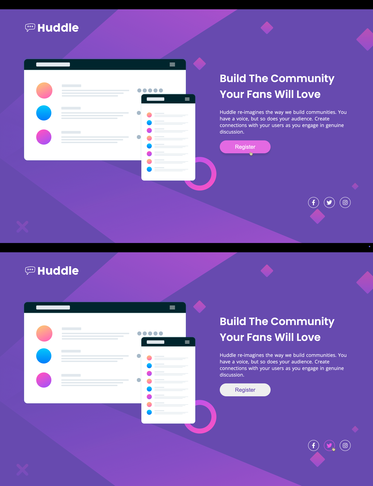

# Huddle Landing Page With a Single Introductory Section

Essa é uma solução para o [Desafio: "Huddle Landing Page With a Single Introductory Section" do Frontend Mentor](https://www.frontendmentor.io/challenges/huddle-landing-page-with-a-single-introductory-section-B_2Wvxgi0). Os desafios que esse site oferece ajuda desenvolvedores a melhorar suas habilidades de código!

## O Desafio

### Requisitos

- O site deve funcionar em diferentes resoluções mantendo a fidelidade com o layout responsivo.

- Os usuários devem ser capazes de visualizar os estados de foco de todos os elementos interativos da página.

## Tecnologias Utilizadas

- HTML

- CSS

## Preview

### Desktop

### Mobile

### Active States

